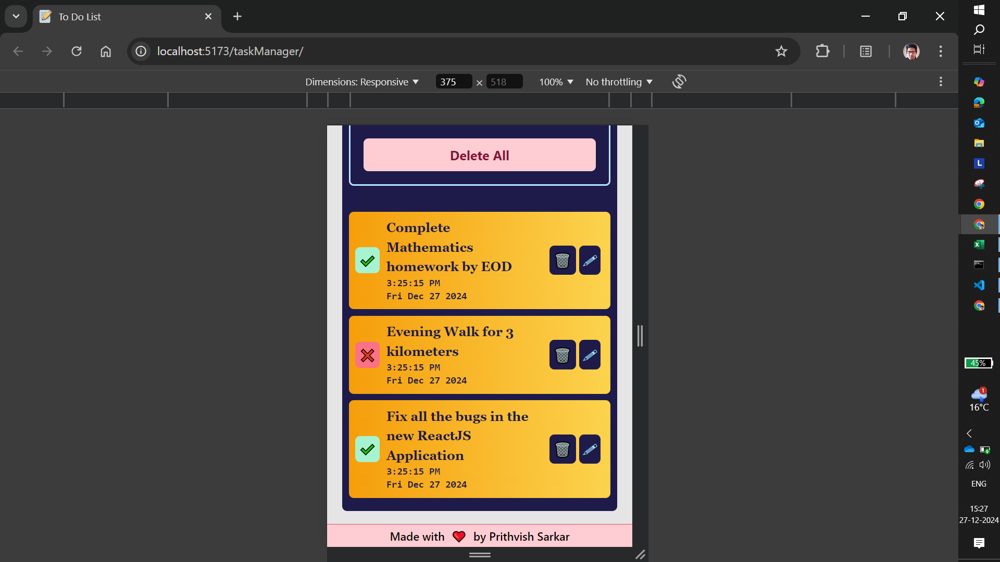

# Task Manager Application

The **Task Manager Application** is a feature-rich ReactJS App designed to simplify task management. With its sleek and responsive design powered by TailwindCSS and persistent data storage using Local Storage, this Application ensures a seamless experience for users across all devices.

## Applications in Real Life

The Task Manager Application is a versatile tool catering to a wide range of age groups and professions, making it invaluable for:

- **School and College Students**:

  - Helps in organizing assignments, study schedules, and extracurricular activities
  - Simplifies task management, ensuring nothing important is missed

- **Busy Professionals**:

  - Tracks work tasks, deadlines, and meetings efficiently
  - Maintains focus by clearly marking tasks as done or pending

- **Senior Citizens**:

  - Provides an easy-to-use interface to track daily chores and appointments
  - Ensures tasks are remembered and completed without hassle

By enabling users to maintain a **to-do list** and toggle between **done/undone statuses**, this app makes it easy to track which tasks are completed and which remain pending. Whether it’s managing academic responsibilities, professional projects, or personal chores, the Task Manager Application helps users stay organized and productive.

## User Interface

- **Task Input Section**:
  - A text input field to enter tasks
  - A button labeled **Add Task** to add tasks to the list
  - A **Delete All** button to clear all tasks

- **Task List Section**:
  - Displays all added tasks as a list
  - Each task includes
    - A **Toggle Button** to toggle between **Not Done** (cross mark) and **Task Done** (tick mark)
    - The **Task Text** along with the **Date and Time** when it was added
    - A **Bin Icon** to delete that specific task
    - A **Pen Icon** which opens a Modal to edit the task

- **Responsive Design**:
  - Optimized for mobile, tablet, and desktop devices using **TailwindCSS**

## Functionalities

- **Add a Task**:
  - Enter a task in the input field and click **Add Task**
  - If the input field is empty, an **Alert Modal** is displayed for 3 seconds to warn the user that the task is empty and to enter a task

- **Toggle Task Status**:
  - The default status of a task is **Not Done** (cross mark)
  - Clicking the toggle button changes the status to **Task Done** (tick mark) and vice versa

- **Edit a Task**:
  - Click on the **Pen Icon** next to the task text to open the **Edit Modal**
  - The Modal contains an input field to update the task
  - The Modal has two buttons with the following functionalities:
    - **Edit Task**: Updates the task with the new text
    - **Cancel**: Closes the Modal without any changes

- **Delete a Task**:
  - Click on the **Bin Icon** next to a task to delete it from the list

- **Delete All Tasks**:
  - Click on the **Delete All** button to open a confirmation Modal
  - Option Buttons in the Modal:
    - **Delete**: Deletes all tasks, clears *Local Storage*, and reloads the App
    - **Cancel**: Closes the Modal without performing any action

- **Persistent Storage**:
  - All tasks, along with their statuses and timestamps, are stored in Local Storage
  - Data is retained even after refreshing or closing the App

- **Alert Modal**:
  - If the user tries to add a task without entering text, an alert Modal Appears for 3 seconds, warning them to provide a task description.

- **Responsive Design**:
  - The Application is built with TailwindCSS, ensuring a smooth and adaptable user experience across devices.

## Technology Stack

- **ReactJS**: For building the frontend
- **Vite**: Ensures faster development and optimized builds
- **TailwindCSS**: For a responsive, mobile-first design
- **Local Storage**: For data persistence

## Installation and Setup

Follow these steps to set up the App locally:

- **Clone the Repository**:

```bash
git clone https://github.com/prithvishsarkar/taskManager.git
cd taskManager
```

- **Install Dependencies**: ```npm install```
- **Start the Development Server**: ```npm run dev```

## How to use the Application?

- **Add Task**: Type a task in the input field and click *Add Task* button
- **Mark Task Status**: Toggle between *Not Done* and *Task Done* using the toggle button
- **Edit Task**: Click the *Pen Icon* next to a task text, update it in the modal, and click *Edit Task* button to save changes

- **Delete Task**: Use the *Bin Icon* to remove individual tasks
- **Delete All Tasks**: Click *Delete All* and confirm to clear all tasks
- **Responsive Design**: Use the App on mobile, tablet, or desktop devices

## Acknowledgements

- **ReactJS Documentation**: [ReactJS](https://react.dev/learn);
- **TailwindCSS Documentation**: [TailwindCSS](https://tailwindcss.com/docs/installation)

## Application Instances



